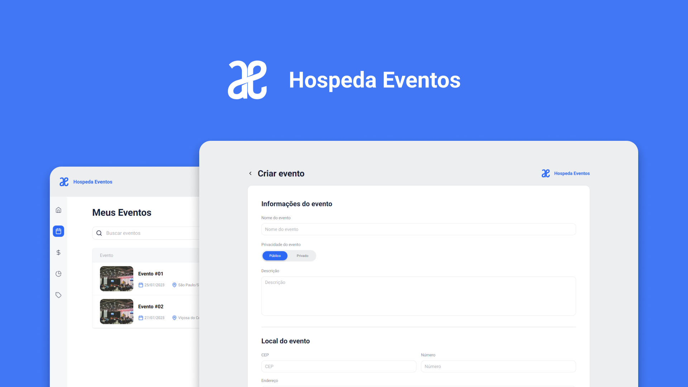

<h1 align="center">
  
</h1>

<h3 align="center">
  Hospeda Eventos API 📅
</h3>

Este projeto se trata da API Rest da aplicação Hospeda Eventos.

## 🚀 Tecnologias

Tecnologias que usei para desenvolver a aplicação:

- [NodeJS](https://nodejs.org/)

- [PrismaJS](https://www.prisma.io/docs)

- [Express](https://expressjs.com/pt-br/)

- [Zod](https://zod.dev/)

- [Typescript](https://www.typescriptlang.org/)

## 💻 Como começar

### 1. Instalação

    npm install

### 2. Renomear: `.env.example` para: `.env`

### 3. Inicializar o app

    npm run dev

## ☕ REST API

Esta aplicação se trata de uma API Rest para a aplicação Hospeda Eventos, nela é possível fazer um CRUD (Create, Read, Update and Delete) de eventos. Alguém se encontra uma lista com os principais end-points usados na aplicação.

## Listar todos os eventos

### Request

`GET /event/list/`

    curl -i -H 'Accept: application/json' http://localhost:3333/event/list/

### Response

    HTTP/1.1 200 OK
    Date: Thu, 24 Feb 2011 12:36:30 GMT
    Status: 200 OK
    Connection: close
    Content-Type: application/json
    Content-Length: 2

    [
      {
          "id": "770c664f-d78e-4df9-b04f-cda41477575f",
          "name": "Test Event",
          "privacy": "public",
          "city": "São Paulo",
          "state": "SP",
          "initialDate": "2023-07-28T00:00:00.000Z",
          "initialTime": "22:45"
      },
    ]

## Criar um evento

### Request

`POST /event/`

    curl -i -H 'Accept: application/json' -d 'name=Foo&status=new' http://localhost:3333/event

### Response

    HTTP/1.1 201 Created
    Date: Thu, 24 Feb 2011 12:36:30 GMT
    Status: 201 Created
    Connection: close
    Content-Type: application/json
    Location: /thing/1
    Content-Length: 36

    {
      "name": "Evento Teste",
      "privacy": "private",
      "description": "Meu evento de teste",
      "address": {
        "zipCode": "62300-000",
        "number": "233",
        "complement": "Meu complemento",
        "neighborhood": "Zona Verde",
        "city": "Viçosa do Ceará",
        "state": "CE"
      },
      "initialDate": "2023-07-24T00:09:02.773Z",
      "initialTime": "23:48"
    }

## Listar um evento específico

### Request

`GET /show/:id`

    curl -i -H 'Accept: application/json' http://localhost:3333/show/de527d53-d728-4444-8115-f2e703407272

### Response

    HTTP/1.1 200 OK
    Date: Thu, 24 Feb 2011 12:36:30 GMT
    Status: 200 OK
    Connection: close
    Content-Type: application/json
    Content-Length: 36

    {
      "id": "de527d53-d728-4444-8115-f2e703407272",
      "name": "Novo Evento Bombástico",
      "privacy": "public",
      "description": "",
      "initialDate": "2023-08-04T00:00:00.000Z",
      "initialTime": "23:50",
      "address": {
        "id": "ba3a1b71-a3e5-4258-9394-603616546e93",
        "city": "São Paulo",
        "state": "SP",
        "zipCode": "01001-000",
        "street": "Praça da Sé",
        "complement": "lado ímpar",
        "neighborhood": "Sé",
        "number": "1004"
      }
    }

## Atualizar um evento

### Request

`PUT /event/:id`

    curl -i -H 'Accept: application/json' -X PUT http://localhost:3333/event/5aa22355-057c-4abc-bf97-d59110e7ae77

### Response

    HTTP/1.1 200 OK
    Date: Thu, 24 Feb 2011 12:36:31 GMT
    Status: 200 OK
    Connection: close
    Content-Type: application/json
    Content-Length: 40

    {
      "message": "Event updated successfully"
    }

## Deletar um evento

### Request

`DELETE /event/:id`

    curl -i -H 'Accept: application/json' -X DELETE http://localhost:3333/event/6ed2d3f9-331f-45d8-b36d-82f11d6546f4

### Response

    HTTP/1.1 200 OK
    Date: Thu, 24 Feb 2011 12:36:32 GMT
    Status: 200 OK
    Connection: close

    {
      "message": "Event deleted successfully"
    }

Made with :purple_heart: by Matheus Alves 🤝 [See my linkedin](https://www.linkedin.com/in/matheralvs/)
